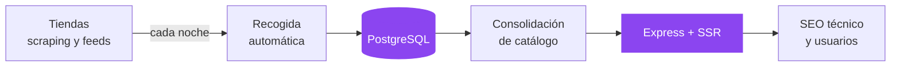

  

  
  
  
  

## Hola, soy Álvaro

Desarrollador web full-stack junior. Me gusta construir producto de principio a fin: los datos, el backend, la interfaz y el despliegue. He trabajado con **.NET** en empresa y mantengo en producción mi propio proyecto con **Node.js y PostgreSQL**.

Antes de programar pasé años en ventas y soporte técnico. De ahí viene lo que más me importa: que el producto funcione y que quien lo usa lo entienda.

> **Busco mi primer puesto como desarrollador junior** en .NET, Java o Node.js.
> Incorporación inmediata · presencial, híbrido o remoto.

## En qué trabajo ahora: [TuPala.es](https://tupala.es)

Comparador de precios de palas de pádel en producción. Reúne el catálogo de las principales tiendas del sector, lo actualiza solo cada día y ayuda a encontrar la pala adecuada por forma, balance y nivel, no solo la más barata. Lo diseño, lo programo y lo mantengo yo.

- **Datos:** recogida diaria automática desde varias tiendas, con control de errores y registro de cada ejecución.
- **Catálogo:** sistema propio que reconoce el mismo producto en tiendas distintas y propone unificar sus fichas, con revisión antes de aplicar cambios.
- **Web:** renderizado en servidor, datos estructurados, sitemap dinámico y páginas de colección generadas desde el catálogo.
- **Despliegue:** continuo en Railway con cada push a `main`.

El repositorio es privado porque es un proyecto profesional; la mayor parte de la actividad del gráfico de contribuciones es suya. Si quieres ver el código, te lo enseño en una demo.

## Stack

<table>
  <tr>
    <th align="left">En producción (TuPala)</th>
    <th align="left">En empresa (.NET)</th>
    <th align="left">Ciclo de DAW</th>
  </tr>
  <tr valign="top">
    <td>
       
       
       
       
      
    </td>
    <td>
       
       
       
      
    </td>
    <td>
       
       
       
       
      
    </td>
  </tr>
</table>

## Actividad

  

  

## Proyectos públicos

<table>
  <tr valign="top">
    <td width="50%">
      <a href="https://github.com/AlvaroDEVicente/sanroque-2026"><b>sanroque-2026</b></a> 
      Web del programa de las fiestas de San Roque de Valdeobispo. Mobile-first, acceso por QR desde los carteles y sin dependencias. Estuvo en uso durante las fiestas de 2026. 
      HTML · CSS · JavaScript
    </td>
    <td width="50%">
      <a href="https://github.com/AlvaroDEVicente/Gestion-Agricola"><b>Gestion-Agricola</b></a> 
      Gestión de explotaciones agrícolas: parcelas dibujadas sobre mapa, tareas de maquinaria por roles y facturación. 
      PHP · MySQL · Leaflet
    </td>
  </tr>
  <tr valign="top">
    <td width="50%">
      <a href="https://github.com/AlvaroDEVicente/Aureus-MVC"><b>Aureus-MVC</b></a> 
      Plataforma de subastas de arte hecha en equipo. MVC en PHP sin framework y transacciones en MySQL. Yo llevé el frontend y la integración de pagos con PayPal. 
      PHP · MySQL · JavaScript
    </td>
    <td width="50%">
      <a href="https://github.com/AlvaroDEVicente/Caza-del-tesoro"><b>Caza-del-tesoro</b></a> 
      Juego de tablero en el navegador: movimiento por tiradas, validación de formularios y récords guardados en el navegador. 
      JavaScript vanilla
    </td>
  </tr>
</table>

